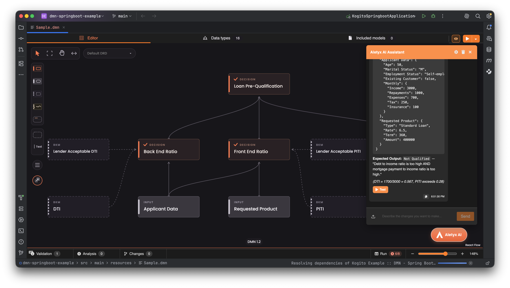
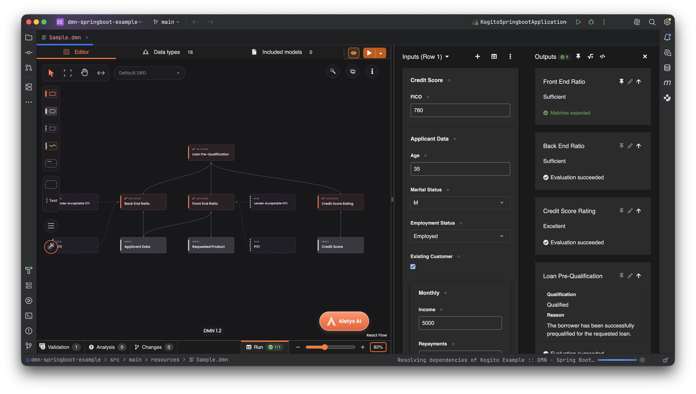
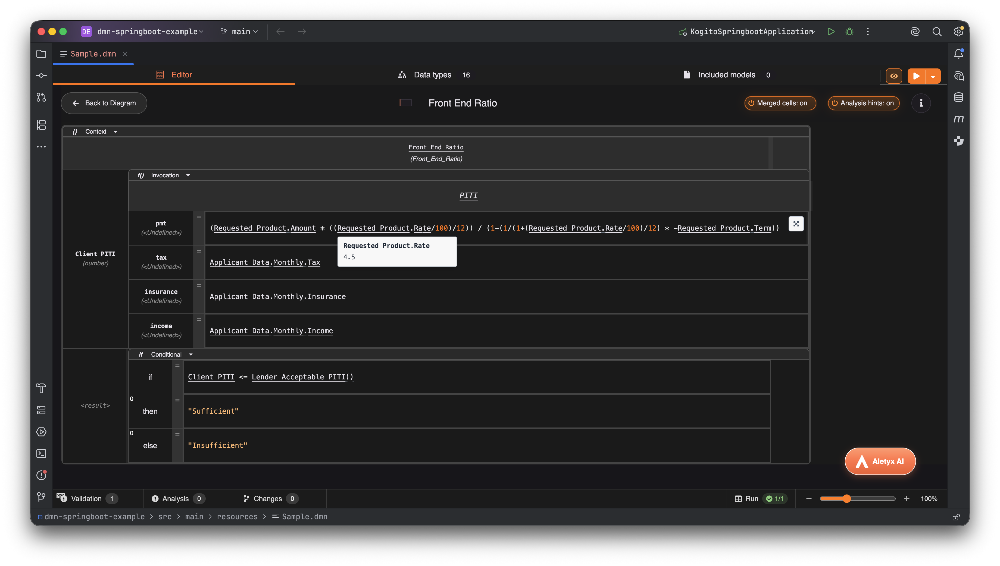

# Aletyx Automation Design for JetBrains IDEs

**Design, run, analyze, and improve business decisions without leaving your IDE.**

Aletyx Automation Design brings a serious DMN workspace to IntelliJ IDEA and compatible JetBrains IDEs. Build decision models visually, work with FEEL confidently, exercise decisions against real inputs, review changes at model level, and use AI to accelerate the work while you remain in control of every edit.

Using Visual Studio Code? See [Aletyx Automation Design for VS Code](README.md).

## Built for developers who ship decisions

- **Visual DMN authoring** — Create and maintain DRDs, decision tables, boxed expressions, data types, decision services, and included models in a polished graphical editor.
- **FEEL that feels like code** — Get completion, diagnostics, definition navigation, and evaluated values on hover for faster debugging.
- **Run before you ship** — Execute multiple input rows locally, inspect outputs, and pin expected results as regression checks with immediate pass/fail feedback.
- **Review semantic changes** — Understand model, node, data-type, expression, row, column, and cell changes with focused highlights and granular accept/revert actions.
- **Find decision-table problems early** — Validation and analysis surface gaps, overlaps, missing rules, and actionable details beside the editor.
- **AI-assisted modeling** — Ask Aletyx AI to explain, analyze, or modify a model. Proposed edits arrive as reviewable changes rather than silent rewrites.
- **Native JetBrains experience** — The workbench follows the IDE theme and uses the JetBrains Password Safe for your AI credential.

## See it in action

_Ask Aletyx AI to create realistic test inputs, then send them directly to the integrated runner._

<table>
  <tr>
    <td width="50%"></td>
    <td width="50%"></td>
  </tr>
  <tr>
    <td><em>Pin expected outputs as regression checks and see pass/fail feedback immediately.</em></td>
    <td><em>Inspect live evaluation values on hover to debug decision logic faster.</em></td>
  </tr>
</table>

## Start in seconds

1. Install the plugin and open a `.dmn` or `.dmns` file.
2. Edit visually, then use **Run** to exercise the decision against your inputs.
3. Open **Analysis** to investigate decision-table findings.
4. Open **Aletyx AI** when you want help understanding or changing the model.

The plugin also recognizes `.bpmn` and `.bpmn2` files.

## Aletyx AI Assistant

Use the gear in the Assistant header—or choose **Tools › Aletyx Automation Design › Set AI Assistant API Key**—to add or replace your key. The credential is stored in the JetBrains Password Safe and is supplied only to the local decision backend.

AI-generated model edits are presented in **Changes**, where you can inspect and accept or revert them before they become part of your model.

## Local decision backend

The bundled backend starts automatically when a supported model opens. It requires Java 17 or newer. If Java is not available through `JAVA_HOME` or `PATH`, configure **Settings › Tools › Aletyx Automation Design › Java home**.

Your local model files remain in your project. Content is sent to an Aletyx offering only when you explicitly use a connected feature such as the AI Assistant.

## Actions

Under **Tools › Aletyx Automation Design**:

- **Set AI Assistant API Key**
- **Clear AI Assistant API Key**
- **Restart Decision Backend**
- **Stop Decision Backend**

See the [complete 10.2.0 changelog](https://github.com/aletyx/aletyx-downstream-kie-tools/blob/main/packages/aletyx-intellij-plugin/CHANGELOG.md).

Copyright © 2025–2026 Aletyx, Inc. Use is governed by the [Aletyx Automation Design license](https://github.com/aletyx/aletyx-downstream-kie-tools/blob/main/packages/aletyx-intellij-plugin/LICENSE).
